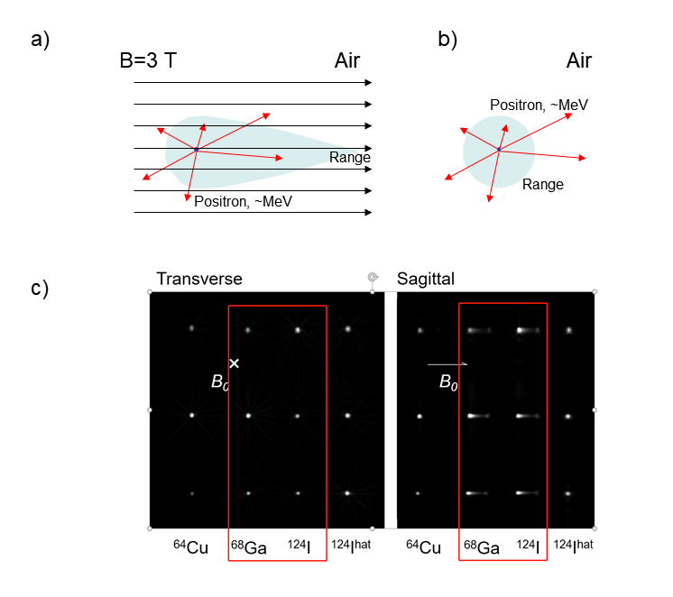

# PMRMC

## Problem

In PET/MR imaging, a special phenomenon is observed. For positrons with longer ranges, the PSF measured in air is deformed. However, without the magnetic field, the positron range is approximately spherical.

The aim of this code is to reproduce the phenomenon.



*The schematic representation of the phenomenon a) with and b) without the magnetic field. The preliminary results are shown in c).*

## Basic algorithms

1. Many positrons are simulated, independent from each other.
2. The initial scalar velocity follows a Maxwell distribution, and the direction of the velocity is random.

> **Hint**
>
> In a uniform distribution across the surface of a sphere, the coordinates can be generated as follows:
>
> ```math
> \theta = 2 \pi u; \ 
> \phi = \sin ^{-1}(2 v-1)
> ```
>
> where $`u`$ and $`v`$ are random variables following a uniform distribution on [0,1].

3. Lorentz force is considered during the propagation.
4. Scattering is considered, and modeled with a Russian roulette.
5. The scattering angle is (temporarily) uniformly distributed.
6. The annihilation is modeled with a Russian roulette.

## Output data format

The output data is in 6 columns.

```csv
Position X, Position Y, Position Z, Velocity X, Velocity Y, Velocity Z
```

## Functionalities

1. Follow the track of a certain positron before annihilation.
2. Plot all annihilation sites as a point cloud.

## Dependencies

- [RANDRAW](https://ww2.mathworks.cn/matlabcentral/fileexchange/7309-randraw)